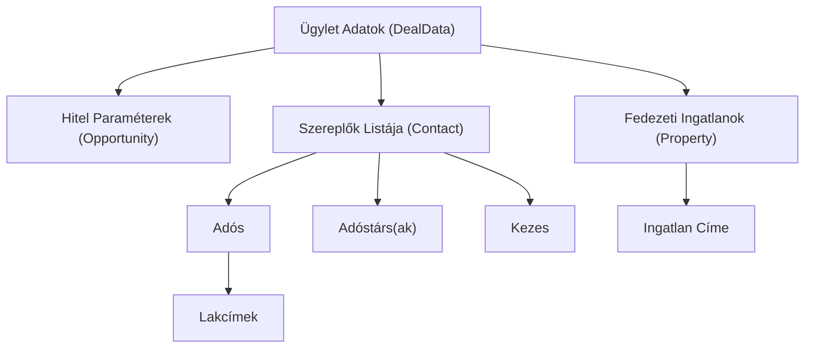

# Kanonikus Mezők Útmutatója (FinancialGenie)

Ez a dokumentum bemutatja a FinancialGenie rendszerében használt **kanonikus mezőket** (Canonical Items), azok belső struktúráját, és azt, hogy hogyan segítik a Salesforce adatok automatikus és pontos beírását a különböző banki PDF nyomtatványokba.

---

## 1. Mi az a Kanonikus Mező (Canonical Field)?

Amikor egy banki hiteligénylő PDF-et kell kitölteni, a legnagyobb kihívást az jelenti, hogy minden bank különböző módon nevezi el a mezőit. Például az adós nevét az egyik PDF `Adós neve` vagy `borrower_name` néven kéri, míg a másik `Text_Field_12` néven azonosítja.

A **kanonikus mezők** a FinancialGenie **belső, egységes "világnyelvét"** alkotják. Ahelyett, hogy minden egyes banki PDF-hez egyedi programot írnánk, a rendszert megtanítottuk egy univerzális sémára. 

A folyamat a következő:
1. A **Salesforce**-ból lekérjük az ügyfél és a hitel adatait.
2. Ezeket az adatokat átalakítjuk (normalizáljuk) a FinancialGenie saját **kanonikus adatmodelljévé**.
3. A **Mapping Stúdióban** összekötjük a PDF egyedi mezőit a megfelelő kanonikus mezővel (pl. a PDF `Text_Field_12` mezőjéhez hozzárendeljük a `Contact.Name` kanonikus mezőt).
4. A rendszer automatikusan kitölti a PDF-et a megfelelő adatokkal.

---

## 2. A Kanonikus Adatmodell Felépítése

A FinancialGenie belső adatmodellje (a **DealData**) három fő egységre (entitásra) épül:

### A) Hitel és Ügylet adatai (`Opportunity`)
Ezek az ügylet alapvető, globális paraméterei. Az űrlapon általában egyszer szerepelnek.

*   `Opportunity.Term_k__c`: A választott hiteltermék neve (pl. *OTP Lakáshitel*).
*   `Opportunity.Hitel_sszeg__c`: Az igényelt kölcsön összege forintban (pl. *25 000 000 Ft*).
*   `Contact.Loan_period__c`: A futamidő hónapokban (pl. *240 hónap*).
*   `Contact.Loan_Purpose__c`: A hitel célja (pl. *használt lakás vásárlása*).
*   `Contact.Interest_Period__c`: Kamatperiódus (pl. *10 éves kamatperiódus*).

### B) Szereplők adatai (`Contact`)
Az ügyletben részt vevő személyek adatai. Mivel egy hitelhez tartozhat egy adós, de akár több adóstárs és kezes is, a rendszer ezeket a szerepük szerint azonosítja:
*   **Adós (Borrower)**: A fő igénylő.
*   **Adóstárs (Co-borrower)**: A hitelbe bevont további szereplő(k).
*   **Kezes (Guarantor)**: A hitel fizetéséért kezességet vállaló személy.

Főbb szereplőhöz köthető kanonikus mezők:
*   `Contact.Name`: A szereplő teljes neve.
*   `Contact.Szuletesi_nev__c`: Születési név.
*   `Contact.Mother_s_Name__c`: Anyja születési neve.
*   `Contact.Place_of_Birth__c` / `Contact.Date_of_birth__c`: Születési hely és idő.
*   `Contact.Tax_ID__c`: Adóazonosító jel.
*   `Contact.ID_Card_Number__c`: Személyazonosító igazolvány száma.
*   `Contact.Address_Card_Number__c`: Lakcímkártya száma.
*   `Contact.Permanent_address__c`: Állandó lakcím (strukturáltan bontva: irányítószám, város, utca, házszám, emelet, ajtó).
*   `Contact.Phone` / `Contact.Email`: Kapcsolattartási adatok.
*   `Contact.Name_of_employer__c`: Munkáltató neve.
*   `Contact.Average_monthly_net_income__c`: Havi nettó igazolt jövedelem.

> [!NOTE]
> **Szerepkör-alapú elosztás:** A PDF-sablonokban a rendszer automatikusan felismeri, hogy az adott oldal vagy mezőcsoport melyik szereplőre vonatkozik (pl. az 1. oldalon az Adós adatai, a 2. oldalon az Adóstárs adatai), és a megfelelő személy adatait helyezi el oda.

### C) Fedezeti ingatlanok adatai (`Property`)
A hitel mögé bevont ingatlanfedezetek adatai.

*   `Property.Property_Type__c`: Ingatlan típusa (pl. *lakás*, *családi ház*, *telek*).
*   `Property.Property_value__c`: Az ingatlan becsült forgalmi értéke vagy vételára.
*   `Property.Ingatlan_hrsz__c`: Helyrajzi szám (HRsz).
*   `Property.Ingatlan_alapterulet__c`: Alapterület négyzetméterben.
*   `Property.Permanent_address__c`: Az ingatlan pontos címe.

---

## 3. Különleges Mezőtípusok és Működésük

### 1. Jelölőnégyzet Csoportok (Checkbox Groups)
Sok nyomtatványon nem szövegesen kell beírni az adatokat, hanem jelölőnégyzetek (checkboxok) bejelölésével. Például az ingatlan típusánál 4 különböző jelölőnégyzet van: `[ ] Lakás`, `[ ] Családi ház`, `[ ] Telek`, `[ ] Egyéb`.

A FinancialGenie ezt **Jelölőnégyzet Csoportként** kezeli:
*   A Mapping Stúdióban a 4 jelölőnégyzetet **csoportosítjuk** (pl. közös `group_id` azonosítót kapnak: `property_type`).
*   Mindegyikhez hozzárendelünk egy **egyező értéket** (`match_value`), pl. a Lakás checkboxhoz a `lakás` értéket.
*   Amikor a Salesforce-ból megérkezik az adat, hogy az ingatlan típusa `lakás`, a kitöltő motor megkeresi ezt a csoportot, és **kizárólag a „lakás” értékű checkboxot pipálja be** (értéke: `"igen"`), a töbmit pedig üresen hagyja (értékük: `"nem"`).

### 2. Címek strukturált felosztása
A Salesforce-ban a címek gyakran egyetlen sorban vannak tárolva (pl. *1051 Budapest, József nádor tér 5.*). A banki PDF-ek viszont szinte mindig külön mezőkben kérik az irányítószámot, a települést, a közterület nevét és a házszámot.

A háttérben futó **Normalizáló motor (Normalizer)** a címeket automatikusan szétszedi az alábbi kanonikus részekre:
*   `zip_code`: `1051`
*   `city`: `Budapest`
*   `street`: `József nádor tér`
*   `house_number`: `5`
*   `floor` és `door` (ha meg van adva)

Így a Mapping Stúdióban ezeket külön-külön rá lehet húzni a PDF megfelelő mezőire.

---

## 4. Miért jó ez a struktúra a felhasználónak?

*   **Egyszeri konfiguráció:** Ha egy PDF-hez egyszer beállítottuk a mappinget, az összes jövőbeli Salesforce ügylet kitöltése egyetlen kattintással elvégezhető.
*   **Biztonság és hibamentesség:** Nem fordulhat elő, hogy egy adóstárs adatai az adós rovatába kerülnek, mivel a szerepkör-kezelés szigorúan szétválasztja a résztvevőket.
*   **AI segítség:** A beépített mesterséges intelligencia (Claude) a kanonikus mezők struktúráját használva javasol automatikus leképezéseket a nyomtatvány elemzésekor, minimalizálva a manuális munkát.
