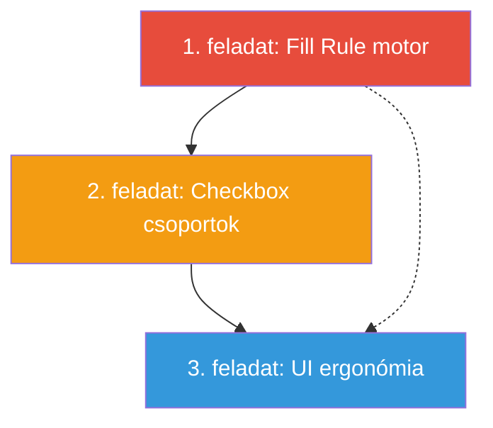

# FinancialGenie – Fejlesztési Brief

> **Cél:** Három fejlesztési feladat specifikációja a FinancialGenie Mapping Stúdióhoz.
> Minden feladatnál le van írva: mit kell csinálni, mi a Definition of Done, milyen fájlokat érint, mire kell figyelni.

---

## 1. feladat: Statikus/üzleti szabály alapú mezőkitöltés

### Mi a probléma?

Az OTP dokumentumcsomagban (97 oldalas master PDF) vannak olyan oldalak (pl. 22-30. oldal – nyilatkozatok, CSOK Plusz 60. oldaltól, Otthon Start 69. oldaltól), amelyeken a checkboxok **NEM egyedi Salesforce mezőkből** kapják az értéküket, hanem **üzleti szabályok** alapján töltődnek ki:

- "Minden ügyletben szereplő bepipálásra kerül"
- "Ha a hitelcél = új ingatlan vásárlás, akkor pipálunk"
- "Az adós egyben Fedezettulajdonos(1) is"
- "Minden szereplő a 'nem vagyok'-ot jelöli"

Ezekhez jelenleg **nincs infrastruktúra** a rendszerben. Nincs `default_value`, nincs `static_value`, nincs szabálymotor.

### Pontos üzleti szabályok (az ügyféltől)

**ALAP – 22-30. oldal:**

| Pont | Szabály |
|---|---|
| 1-5. | Szereplők bepipálása a Contact Role-juk szerint. Az adós = Fedezettulajdonos(1), az adóstárs = Fedezettulajdonos(2). A Contact Role a Salesforce-ban elérhető. |
| 6. | Minden szereplő → első blokk "igen" rubrika pipálva |
| 7. | Minden szereplő → minden blokkban "nem vagyok" jelölve. Végén minden szereplő szerepe mellé pipa. |
| 8. | **Feltételes:** Csak ha "évnyerő" terméket választott az ügyfél → minden szereplő bepipálva |
| 9. | Minden szereplő bepipálva |
| 10. | "Nem fog idegen pénznemben fennálló tartozásnak minősülni" → pipa. Végén minden szereplő szerepe mellé pipa. |
| 11-13. | Minden szereplő bepipálva |
| 15. | **Feltételes:** Csak ha SF-ben Hitelcél = "Új ingatlan vásárlás" (`Opportunity.Hitelc_l__c`) → minden szereplő bepipálva |
| 20. | Minden szereplő bepipálva |
| 21. | 1. blokk: minden szereplő "hozzájárulok". 2. blokk: "igen" minden szereplőre. 3. blokk: 1. sor minden szereplőre. |
| 22. | Minden szereplő bepipálva |

**CSOK Plusz – 60. oldaltól:**

| Pont | Szabály |
|---|---|
| 3-4. | Minden szereplő bepipálva |
| 8-9. | Minden szereplő bepipálva |
| 14. | Minden szereplő bepipálva |
| 30. | Minden szereplő bepipálva |

**Otthon Start – 69. oldaltól:**

| Pont | Szabály |
|---|---|
| 2, 3, 6. | Minden szereplő bepipálva |

### Mit kell csinálni?

#### 1.1 Mapping JSON séma bővítése

Egy új mező kell a mapping JSON-ban: `fill_rule`. Ez határozza meg, hogy a mező értéke honnan jön:

```json
{
  "pdf_field_name": "NYIL_7_nem_vagyok_ados",
  "label": "7. pont – Nem vagyok (adós)",
  "field_type": "checkbox",
  "canonical_field": null,
  "fill_rule": {
    "type": "static",
    "value": "igen"
  }
}
```

Javasolt `fill_rule` típusok:

| `type` | Jelentés | Példa |
|---|---|---|
| `"static"` | Mindig ez az érték | `{"type": "static", "value": "igen"}` |
| `"per_participant"` | Minden szereplőre kitöltődik | `{"type": "per_participant", "value": "igen"}` |
| `"conditional"` | SF mező értékétől függ | `{"type": "conditional", "sf_field": "Opportunity.Hitelc_l__c", "match": "Új ingatlan vásárlás", "value": "igen"}` |
| `"role_based"` | Szereplő szerepe alapján | `{"type": "role_based", "roles": ["adós", "adóstárs"], "value": "igen"}` |

#### 1.2 Kitöltő motor bővítése

A `FormFillerPipeline._prepare_field_data()` metódusban (fájl: `src/main.py`) kezelni kell a `fill_rule`-t a `canonical_field` mellett.

#### 1.3 Frontend – fill_rule szerkesztő

A Mapping Stúdió PageEditor-ában a felhasználó be tudja állítani a `fill_rule`-t, ha a mező `canonical_field`-je üres.

### Érintett fájlok

| Fájl | Változás |
|---|---|
| `src/mapping/*.json` | Séma bővítés: `fill_rule` mező |
| `src/main.py` | `_prepare_field_data()` – fill_rule kezelés |
| `src/ai/field_recognizer.py` | `RecognizedField` dataclass – `fill_rule` mező hozzáadása |
| `frontend/src/types/index.ts` | `MappingField` interface bővítése |
| `frontend/src/components/PageEditor.tsx` | Fill rule szerkesztő UI |
| `backend/server.py` | `FieldUpdate` modell bővítése |

### Definition of Done

- [ ] A mapping JSON-ban használható a `fill_rule` mező
- [ ] A kitöltő motor a `fill_rule` alapján is ki tud tölteni mezőket
- [ ] Statikus, per_participant, conditional, role_based típusok működnek
- [ ] A Mapping Stúdióban beállítható a `fill_rule`
- [ ] A fenti üzleti szabályok (ALAP 22-30, CSOK Plusz, Otthon Start) implementálva vannak
- [ ] A kitöltött PDF-ben a megadott checkboxok ténylegesen be vannak pipálva

### Buktatók

> [!WARNING]
> **Oldal-mapping hiányzik:** A 22-30. oldalakhoz, CSOK Plusz 60+, Otthon Start 69+ oldalakhoz jelenleg **egyáltalán nincs mapping JSON**. Először ezeket az oldalakat kell az AI-val vagy kézzel feltérképezni (mezőnevek, koordináták), és csak utána lehet `fill_rule`-okat rendelni hozzájuk.

> [!IMPORTANT]
> **Per-participant logika:** A "minden szereplő bepipálásra kerül" nem egyszerű – a PDF-ben minden szereplőhöz külön checkbox van (pl. `NYIL_9_ados`, `NYIL_9_adostars`, `NYIL_9_kezes`). A `fill_rule` motornak tudnia kell, hogy az adott deal-ben hány és milyen szerepű szereplő van, és csak a releváns checkboxokat pipálja be.

> [!NOTE]
> **A `fill_rule` és a `canonical_field` kölcsönösen kizáró:** Ha van `canonical_field`, az SF-ből jön az adat. Ha nincs, akkor a `fill_rule` adja.

---

## 2. feladat: Checkbox csoportok javítása

### Mi a probléma?

A checkbox csoport funkció **elméletben létezik** a rendszerben, de **a gyakorlatban nem működik**:

1. **Minden mapping JSON-ban a `checkbox_group` értéke `null`** – egyetlen mező sincs csoportba sorolva
2. Az AI felismerő (`field_recognizer.py`) tartalmaz checkbox group detection promptot, de a generált mapping-ekben nem jelennek meg a csoportok
3. Volt olyan eset, hogy **egymásnak ellentmondó checkboxokat** is bepipált a rendszer (pl. "lakás" ÉS "ház" egyszerre)
4. Bizonyos mezőkhöz **egyáltalán nincs mapping**, pedig lehetne

### Jelenlegi állapot

**Mapping JSON-ban (per-field):**
```json
{
  "pdf_field_name": "property_type_apartment",
  "canonical_field": "Lead.Ingatlan_jellege__c",
  "field_type": "checkbox",
  "checkbox_group": null  // ← MINDIG null!
}
```

**Kitöltő motor** (`src/main.py:365-413`): A `FormFillerPipeline` logikája létezik: `group_id` alapján csoportosít, SF picklist értéket összehasonlítja a `match_value`-val, és csak az egyezőt pipálja be. De mivel nincs egyetlen `checkbox_group` sem kitöltve, ez a kód **soha nem fut le**.

**AI prompt** (`src/ai/field_recognizer.py:702-718`): A prompt utasítja a Claude-ot, hogy használja a `"g"` és `"mv"` kulcsokat checkbox csoportokhoz. A parse logika (`L803-814`) is kezeli. De a generált mapping-ekbe végül mégsem kerülnek be.

### Mit kell csinálni?

#### 2.1 Meglévő mapping-ek auditálása

Végig kell menni az összes mapping JSON-on (`src/mapping/*.json`) és azonosítani:
- Mely checkbox mezők tartoznak logikailag össze (ugyanaz a canonical_field, kölcsönösen kizáró értékek)
- Mely mezőkhöz nincs mapping, pedig lehetne
- Hol van ellentmondás (több checkbox = igen ugyanarra a SF mezőre)

#### 2.2 Checkbox group adatok feltöltése

A `checkbox_group` mezőket ki kell tölteni a releváns mapping JSON-okban:

```json
{
  "pdf_field_name": "property_type_apartment",
  "canonical_field": "Lead.Ingatlan_jellege__c",
  "field_type": "checkbox",
  "checkbox_group": {
    "group_id": "property_type",
    "match_value": "lakás"
  }
}
```

Ahol a `match_value` az SF picklist érték, amire az adott checkbox "igen"-re vált.

#### 2.3 AI felismerés javítása

Meg kell vizsgálni, hogy:
- A Claude miért nem generálja a `"g"` / `"mv"` kulcsokat a válaszában
- A parse logika tényleg helyesen kezeli-e a válasz formátumot
- A flat PDF recognizer (`recognize_flat`) **egyáltalán nem támogatja** a checkbox group detekciót – ez hiányzik

#### 2.4 Kitöltő motor tesztelése

A `FormFillerPipeline` checkbox group logikáját tesztelni kell:
- Egy csoportból **pontosan egy** checkbox legyen bepipálva
- Ha a SF érték nem egyezik semmivel → egyiket sem pipálja
- Ha nincs SF adat → ne pipáljon semmit

### Érintett fájlok

| Fájl | Változás |
|---|---|
| `src/mapping/*.json` | `checkbox_group` mezők kitöltése |
| `src/ai/field_recognizer.py` | AI prompt + parse javítás, flat PDF checkbox support |
| `src/main.py` | Kitöltő motor checkbox group logika tesztelése/javítása |
| `frontend/src/components/PageEditor.tsx` | Checkbox group szerkesztő UX javítása |

### Definition of Done

- [ ] Minden mapping JSON-ban a checkbox mezőkhöz ki van töltve a `checkbox_group` (ahol releváns)
- [ ] A kitöltő motor egy csoportból pontosan egy checkboxot pipál be az SF érték alapján
- [ ] Nincs ellentmondó checkbox (két "igen" ugyanabban a csoportban)
- [ ] Az AI felismerő a `checkbox_group` adatokat is generálja
- [ ] A Mapping Stúdióban a checkbox csoport szerkeszthető (group_id + match_value)
- [ ] Teszteset: SF-ben `Lead.Ingatlan_jellege__c = "lakás"` → csak a "lakás" checkbox van bepipálva a PDF-ben

### Buktatók

> [!WARNING]
> **A `checkbox_group` PER-FIELD tárolt**, nem top-level `"groups"` tömbben! Az AGENTS.md-ben leírt `"groups"` séma **nem létezik a kódban**. A valódi séma:
> ```json
> // HELYES (per-field):
> { "pdf_field_name": "X", "checkbox_group": {"group_id": "...", "match_value": "..."} }
>
> // NEM LÉTEZIK (top-level):
> { "groups": [{"group_id": "...", "options": [...]}] }
> ```

> [!IMPORTANT]
> **SF picklist értékek:** A `match_value`-nak **pontosan** meg kell egyeznie a Salesforce picklist értékkel. Ezek gyakran magyar ékezetes szavak (pl. "lakás", "ház", "telek"). Kis/nagybetű, ékezet érzékeny!

> [!NOTE]
> **Az `acroform_sample_mapping.json`-ban van 4 checkbox** ami mind `Lead.Ingatlan_jellege__c`-re van mappelve – ez jó kiindulópont a teszteléshez, csak a `checkbox_group`-ot kell kitölteni.

---

## 3. feladat: Mapping Stúdió UI ergonómia javítása

### Mi a probléma?

A jelenlegi PageEditor UI-ban:
1. **Nincs auto-scroll:** Ha a PDF-en rákattintasz egy mezőre, a jobb oldali sáv NEM gördül oda → a felhasználó kézzel keresgéli a mezőt a listában
2. **Kevés dolog szerkeszthető:** Jelenleg csak a `canonical_field` (dropdown) és a `checkbox_group` (2 input) állítható be – a `label`, `field_type`, `notes` nem
3. **Nincs mező hozzáadás UI:** A backend támogatja (`POST /api/mapping/field` + `addField()` az API kliensben), de a frontend nem jeleníti meg
4. **Nincs SF adat-típus info:** A canonical fields dropdown nem mutatja, hogy az adott SF mező milyen típusú (string, boolean, picklist, number, date)

### Mit kell csinálni?

#### 3.1 Auto-scroll kijelölt mezőhöz

Amikor a felhasználó a PDF overlay-en rákattint egy mezőre:
1. A jobb oldali sávban az adott mező kártyája kapjon `scrollIntoView({ behavior: "smooth", block: "center" })` hívást
2. Vizuális kiemelés (már van: kék left-border + háttér)

**Implementáció:** `useRef` + `useEffect` a `selectedField` változásra.

**Fájl:** `frontend/src/components/PageEditor.tsx` L437-452 környékén.

#### 3.2 Mező részletek megjelenítése kattintásra

Amikor egy mező ki van jelölve, a jobb oldali kártyán jelenjen meg:

| Adat | Forrás | Szerkeszthető? |
|---|---|---|
| PDF mező neve | `pdf_field_name` | Nem (readonly) |
| Felismert címke | `label` | Igen |
| Mező típus | `field_type` | Igen (dropdown: text/checkbox/date/number) |
| Canonical field | `canonical_field` | Igen (meglévő dropdown) |
| SF adat típus | canonical-fields API-ból | Nem (csak megjelenítés) |
| Checkbox csoport | `checkbox_group` | Igen (meglévő inputok) |
| Fill rule | `fill_rule` | Igen (1. feladatból) |
| Megjegyzés | `notes` | Igen (textarea) |

**Fontos:** Az SF adat típus (string, boolean, picklist, stb.) jelenleg **nem elérhető** a canonical-fields API-ból. A backend bővítése szükséges:

```python
# Jelenlegi:
{"path": "Contact.Name", "label": "Full Name"}

# Szükséges:
{"path": "Contact.Name", "label": "Full Name", "sf_type": "string"}
```

Ehhez a `CANONICAL_FIELDS` dict-et kell bővíteni `src/ai/field_recognizer.py`-ban, vagy az SF `describe()` API-ból kell lekérni az adat-típusokat.

#### 3.3 Kézi mező hozzáadás

**AcroForm PDF-eknél:**
- "Mező hozzáadása" gomb a jobb oldali sávban
- Dropdown a létező de nem mappelt PDF mezőkből
- Vagy teljesen új mező: pdf_field_name + canonical_field megadása

**Flat PDF-eknél:**
- A felhasználó a PDF képen kijelöl egy téglalap területet (drag)
- Megadja a mező nevét, típusát, canonical field-et
- A rendszer elmenti koordinátákkal

**Backend:** A `POST /api/mapping/field` endpoint és az `addField()` API kliens függvény **már létezik** – csak a frontendet kell megírni.

**Fájlok:**
- `frontend/src/components/PageEditor.tsx` – UI
- `frontend/src/api/client.ts` – `addField()` már kész (L127-136)
- `backend/server.py` – `POST /api/mapping/field` már kész (L314-322)

#### 3.4 Mező törlése

Jelenleg nincs törlés UI. A backend támogatja (`DELETE /api/mapping/field`). Egy "Törlés" gomb kell a mező kártyán, megerősítő dialógussal.

### Érintett fájlok

| Fájl | Változás |
|---|---|
| `frontend/src/components/PageEditor.tsx` | Auto-scroll, bővített mező kártya, hozzáadás/törlés UI |
| `frontend/src/types/index.ts` | `MappingField` bővítése (`fill_rule`), `CanonicalField` bővítése (`sf_type`) |
| `frontend/src/api/client.ts` | Már kész: `addField()`, `deleteField()` |
| `backend/server.py` | canonical-fields endpoint bővítése SF típusokkal |
| `backend/mapping_service.py` | `canonical_fields()` bővítése |
| `src/ai/field_recognizer.py` | `CANONICAL_FIELDS` bővítése típus információval |

### Definition of Done

- [ ] PDF-en mezőre kattintva a jobb sáv automatikusan odagördül
- [ ] A mező kártyán megjelenik: pdf mező név, label, típus, canonical field, SF típus, checkbox group, notes
- [ ] A label, field_type, notes szerkeszthető
- [ ] Az SF adat típus megjelenik a canonical field dropdown-ban (pl. "Contact.Name – string", "Lead.Ingatlan_jellege__c – picklist")
- [ ] Új mező hozzáadható a jobb sávból (AcroForm: dropdown, Flat: terület kijelölés)
- [ ] Mező törölhető megerősítéssel
- [ ] A módosítások a backend-en mentésre kerülnek

### Buktatók

> [!WARNING]
> **A `scrollIntoView` React-ben:** A sidebar mezőkhöz `ref`-eket kell rendelni. Mivel a lista dinamikus, `useRef` tömb vagy `Map<string, HTMLElement>` kell. Ne `document.getElementById`-t használj.

> [!IMPORTANT]
> **SF típus információ beszerzése:** Két opció:
> 1. **Statikus:** A `CANONICAL_FIELDS` dict-et kézzel bővíteni típussal (~250 mező) – egyszeri munka
> 2. **Dinamikus:** A `simple_salesforce` `describe()` API-val lekérni futásidőben – pontosabb, de SF kapcsolat kell hozzá
>
> Javasolt: statikus, mert az AI felismerés offline is működjön.

> [!NOTE]
> **Flat PDF mező hozzáadás:** A koordináták PDF user-space pontokban vannak (72 DPI), nem pixel-ben. A frontend 150 DPI-vel rendereli a képet. Átszámítás: `pdf_coord = pixel_coord / (150/72)`.

---

## Feladatok közötti függőségek



- **1 → 2:** A fill_rule infrastruktúra (statikus értékek) szükséges a checkbox csoportok helyes működéséhez, mert a nyilatkozat-checkboxok egy része statikus szabály alapú
- **2 → 3:** A checkbox csoport logika kell a UI-hoz, hogy a felhasználó szerkeszthesse a csoportokat
- **1 → 3:** A fill_rule szerkesztő UI a 3. feladat része

**Javasolt sorrend:** 1 → 2 → 3 (de a 3. feladat auto-scroll része párhuzamosan is indítható)

---

## Referencia fájlok

| Fájl | Mit tartalmaz |
|---|---|
| [HOW_IT_WORKS.md](HOW_IT_WORKS.md) | Teljes technikai dokumentáció (724 sor) |
| [CANONICAL_FIELDS_HU.md](CANONICAL_FIELDS_HU.md) | Canonical field lista SF adatállapottal |
| [.agents/AGENTS.md](.agents/AGENTS.md) | Projekt szabályok és architektúra |
| [DEPLOY.md](DEPLOY.md) | Telepítési útmutató (Docker, VPS, NAS) |
| [src/main.py](src/main.py) | Kitöltő pipeline (`FormFillerPipeline`) |
| [src/ai/field_recognizer.py](src/ai/field_recognizer.py) | AI felismerő + `CANONICAL_FIELDS` + `RecognizedField` |
| [backend/server.py](backend/server.py) | FastAPI backend (25+ endpoint) |
| [frontend/src/components/PageEditor.tsx](frontend/src/components/PageEditor.tsx) | Vizuális mapping szerkesztő (647 sor) |
